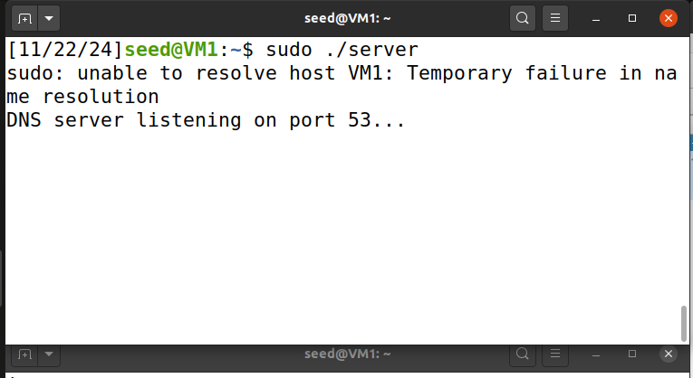

# Programming Assignment - 11/22/24
**Victoria Cai**  
**Gabriel Bezerra**

## Read Me

### Setup

1. **Download Files**  
   Download `server.c` and `client.c` and move them to your VM.

2. **Install Required Tools**  
   Install the following dependencies:
   - **GCC**  
     ```bash
     sudo apt update
     sudo apt install build-essential -y
     ```
   - **Dig**  
     ```bash
     sudo apt install dnsutils -y
     ```

---

### Disabling Conflicting Services

On many Linux systems (like SEED Ubuntu), both `systemd-resolved` and `NetworkManager` may interfere with DNS traffic by using port 53. These must be stopped before running the server.

1. **Check if Port 53 is in Use**  
   Run the following command:  
   ```bash
   $ sudo lsof -i :53
   ```
   If you see something like this:
   ```bash
   COMMAND   PID USER   FD   TYPE DEVICE SIZE/OFF NODE NAME
   systemd-r 536 systemd-resolve   12u  IPv4  18346      0t0  UDP localhost:domain
   ```
   Then systemd-resolved is using port 53.
2. **Disable systemd-resolved**  
    Run the following commands:  
   ```bash
   $ sudo systemctl stop systemd-resolved
   $ sudo systemctl disable systemd-resolved
   ```
    It’s okay if you see this message:
    ```bash
    sudo: unable to resolve host VM3: Temporary failure in name resolution
    Removed /etc/systemd/system/dbus-org.freedesktop.resolve1.service.
    Removed /etc/systemd/system/multi-user.target.wants/systemd-resolved.service.
    ```
3. **Disable NetworkManager**  
    To reduce Wireshark noise, also disable NetworkManager by running:
    ```bash
   $ sudo systemctl stop NetworkManager
   $ sudo systemctl disable NetworkManager
   ```
    It’s okay if you see this message:
    ```bash
    Removed /etc/systemd/system/network-online.target.wants/NetworkManager-wait-online.service.
    Removed /etc/systemd/system/multi-user.target.wants/NetworkManager.service.
    Removed /etc/systemd/system/dbus-org.freedesktop.nm-dispatcher.service.
    ```
4. **Confirm Port 53 is Free**  
    Run the following command again: 
   ```bash
   $ sudo lsof -i :53
   ```
    You should see nothing. It’s okay if you see this:
    ```bash
    sudo: unable to resolve host VM3: Temporary failure in name resolution
    ```
---
### Compile the Code
Compile both the server and client programs:
```bash
$ sudo gcc -o server server.c
$ sudo gcc -o client client.c
```
---
### Running the Server and Client
1. **Start the Server**  
    In one terminal, run: 
    ```bash
    $ sudo ./server
    ```
    You should see:
    
2. **Start the Client**  
    In another terminal, run: 
    ```bash
    $ sudo ./client
    ```
    You should see:
    <!-- Replace with actual screenshot -->
3. **Check Server Terminal**  
    You should see new responses from the client:
    <!-- Replace with actual screenshot -->
---
### Testing with ```dig```
1. **Run the following command**  
    ```bash
    $ dig @localhost aGkA.google.com
    ```
    You should see:
    <!-- Replace with actual screenshot -->
2. **Run the next command**  
    ```bash
    $ dig @localhost aGVsbG8A.google.com
    ```
    You should see:
    <!-- Replace with actual screenshot -->
---
### Using Wireshark to Observe DNS Traffic
1. **Open Wireshark**  
    Capture traffic on the ```Loopback:lo``` interface.
    <!-- Replace with actual screenshot -->
2. **Rerun the Client**  
    ```bash
    $ ./client
    ```
    In Wireshark, you should observe 4 DNS packets.
    You should see:
    <!-- Replace with actual screenshot -->
---
### Clean-Up Steps
To revert the changes, follow these steps:
1. **Re-enable systemd-resolved**  
    ```bash
    $ sudo systemctl enable systemd-resolved
    $ sudo systemctl start systemd-resolved
    ```
2. **Re-enable NetworkManager**  
    ```bash
    $ sudo systemctl enable NetworkManager
    $ sudo systemctl start NetworkManager
    ```
3. **Verify Services are Running**  
Run the following commands to confirm both services are back up:
    ```bash
    $ systemctl status systemd-resolved
    $ systemctl status NetworkManager
    ```


